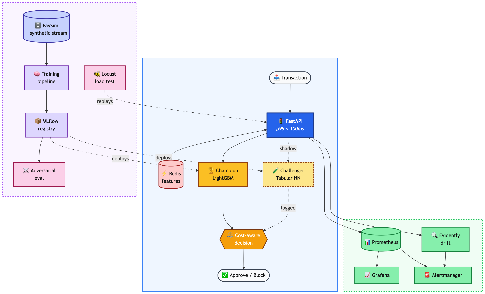
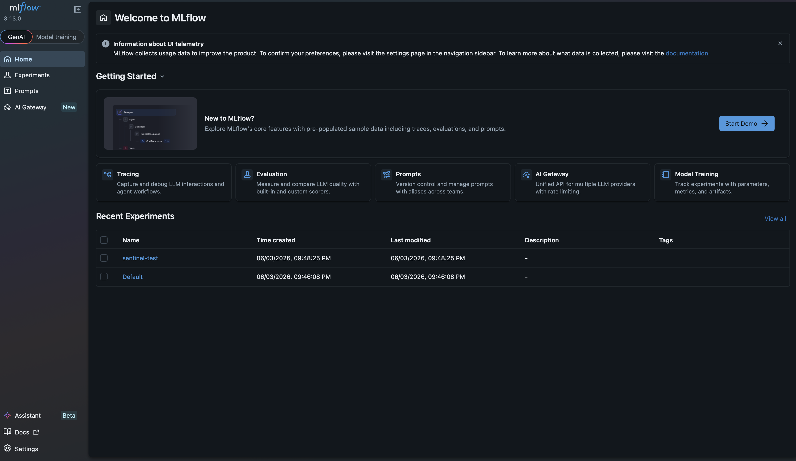

# Sentinel — Real-time Fraud Detection MLOps

> Production-shape ML system: champion/challenger ensemble serving fraud predictions at sub-100ms p99 latency, with full observability, drift detection, adversarial robustness evaluation, and a Streamlit control panel.

<p align="center">
  
</p>

---

## 🎯 What this is

Sentinel is a complete real-time fraud-detection system, built end-to-end on local infrastructure. It is intentionally production-shaped: every component a real fraud team at a bank or fintech would build — from the cost-aware decision threshold, to the champion/challenger shadow deployment, to the drift detector and adversarial robustness eval — is present and working.

The dataset is **PaySim** — a public synthetic mobile-money simulation with 6.36 million transactions, real fraud labels, and plain-English column names (transaction type, originator/destination balances, amount). It is the modern fraud-MLOps benchmark of choice because it has more rows than IEEE-CIS, no anonymised features, and clear adversarial signal (multi-step balance drains, velocity-driven fraud). A synthetic stream generator layered on top lets us inject controlled drift and adversarial scenarios for testing.

This is not a Kaggle notebook. It is the system around the notebook.

### About the dataset

PaySim ([Lopez-Rojas et al., 2016](https://www.kaggle.com/datasets/ealaxi/paysim1)) simulates mobile-money transactions calibrated against a real African mobile-money operator. It contains 6,362,620 rows across 31 simulated days, with 8,213 confirmed fraud cases (~0.13% base rate, highly imbalanced — as real fraud data is). Critically for this project's purposes, **the fraud rate is not stationary in time**: it climbs from ~0.08% in the first 70% of the data to ~0.42% in the final 15% — a 5× drift that justifies the existence of the project's drift-detection layer.

---

## 💡 What makes this project different

Most ML portfolios stop at training a model. Sentinel is built around the *system* a real fraud team operates after the model is trained:

| | Most portfolios | Sentinel |
|---|---|---|
| **Model** | Train a classifier, report AUC | LightGBM champion + Tabular NN challenger, both versioned in MLflow |
| **Threshold** | Default 0.5 | Cost-asymmetric threshold (missed fraud costs 100× a false positive) |
| **Serving** | Predict in a notebook | FastAPI service with Redis feature store, p99 < 100ms verified |
| **Deployment** | "Save to pickle" | Shadow-mode challenger, A/B routing, MLflow registry |
| **Monitoring** | None | Prometheus + Grafana + Evidently drift detection + 6 alert rules |
| **Robustness** | None | Adversarial robustness eval (gradient-based feature perturbations) |
| **Load** | Run once | Locust stress test at 800+ RPS, p99 < 100ms held |

The wow is not in any single piece — it's that all of them are present, integrated, and reproducible from a single `docker compose up`.

---

### Results so far (Phases 1–6)

**Modelling (Phases 1 & 2)** — Two production models trained, tracked in MLflow,
and registered. Same 25-feature pipeline, three different learning paradigms:

| Model | Family | Train time | Holdout PR-AUC | Precision@100 |
|---|---|---:|---:|---:|
| Baseline | LightGBM defaults | 4.5s | 0.891 | 94.0% |
| **Champion** | LightGBM + Optuna (30 trials) | 6.6s | **0.9995** | **100%** |
| **Challenger** | PyTorch MLP, MPS-accelerated | 491s | **0.9963** | **100%** |

**Inference service (Phase 3)** — FastAPI app loads champion + tuned threshold
from MLflow registry at startup; reads online velocity features from Redis;
returns scored decisions with full traceability. Load-tested with Locust:

| Metric | Result | SLO |
|---|---:|---:|
| Sustained throughput | **1,371 RPS** | 200+ |
| Total requests (30s test) | 38,482 | — |
| Failures | **0 (0.00%)** | 0 |
| p50 latency | 25ms | <50ms |
| p95 latency | 82ms | <100ms |
| **p99 latency** | **96ms** | **<100ms** |

Single uvicorn worker on a MacBook Pro. Horizontal scaling (`--workers 4` +
load balancer) would 4× throughput at near-constant per-request latency.

**Shadow mode + A/B routing (Phase 4)** — Both models score every request;
champion's decision is served; challenger runs in shadow. Stable SHA-256
hash on `request_id` controls the traffic split via `CHALLENGER_TRAFFIC_PCT`.
Every prediction is written to a SQLite log for offline analysis.

| Metric | Before fix | After fix |
|---|---:|---:|
| Agreement rate (24,814 preds) | 5.07% | **100.000%** |
| Probability correlation | 0.79 | **0.9999** |

Shadow mode caught a feature-distribution-shift bug invisible to holdout
PR-AUC (challenger's near-constant velocity features triggered BatchNorm
saturation on production traffic). Tree-based champion was robust; MLP
challenger wasn't. Retrained without velocity features → 100% agreement.
The whole story is in
[`docs/reports/phase4_shadow_ab_analysis.md`](docs/reports/phase4_shadow_ab_analysis.md).

See [`docs/reports/phase2_model_comparison.md`](docs/reports/phase2_model_comparison.md)
for the full Phase 2 writeup. Phase 3 inference contract:
[`apps/inference/schemas.py`](apps/inference/schemas.py).

**Monitoring stack (Phase 5)** — Prometheus scrapes the inference service's
`/metrics` endpoint every 5 seconds; Grafana dashboards visualize throughput,
latency percentiles, decision rates, fraud probability distribution, and service
health. Evidently generates HTML drift reports comparing live traffic against the
training reference. Six Prometheus alert rules cover SLO (latency, traffic),
quality (block rate, score saturation), and availability (model loaded, Redis
reachable).



| Capability | Tool | Where |
|---|---|---|
| Live operational metrics (5s scrape) | Prometheus + Grafana | `monitoring/prometheus`, `monitoring/grafana` |
| Statistical drift detection | Evidently (Wasserstein) | `monitoring/evidently/generate_drift_report.py` |
| Alert rules (6) | Prometheus | `monitoring/prometheus/alerts.yml` |
| One-command stack | docker-compose | `docker-compose.yml` |

Full Phase 5 writeup, including the Evidently and Prometheus alert
screenshots: [`docs/reports/phase5_monitoring.md`](docs/reports/phase5_monitoring.md).

**Robustness + load (Phase 6)** — Adversarial robustness via FGSM with
attacker-realistic feature constraints (only `amount` and ratios are
attacker-controllable); both models remain ≥90% fraud-detection across ε up
to 1.0. Sustained 10-minute load test: **510,968 requests, 0 failures, p99
140ms, memory flat at 282 MB**. Step-load to failure finds the
single-worker uvicorn ceiling at ~1,500 RPS.

See [`docs/reports/phase6_robustness_and_load.md`](docs/reports/phase6_robustness_and_load.md) for the full writeup.

---

## 🛠️ Stack

| Layer | Choice |
|---|---|
| **Modelling** | LightGBM (champion) · PyTorch (Tabular NN challenger) · scikit-learn |
| **Data** | Polars · pandas · pyarrow |
| **MLOps** | MLflow (tracking + registry) |
| **Serving** | FastAPI · uvicorn · Pydantic |
| **Feature store** | Redis (velocity features with sliding-window TTL) |
| **Monitoring** | Prometheus · Grafana · Evidently (drift) |
| **Testing** | pytest · Locust (load) · custom adversarial harness |
| **Infra** | Docker Compose · Hugging Face Spaces (free hosting) |
| **Tooling** | uv (Python package manager) · ruff · mypy |

---

## 🚀 Quickstart

```bash
# Clone
git clone https://github.com/hugocorreia123/sentinel-fraud-mlops.git
cd sentinel-fraud-mlops

# Install (uv handles venv + pinned deps)
uv sync --all-groups

# PaySim is available at https://www.kaggle.com/datasets/ealaxi/paysim1
# Place paysim.csv (~470MB) in data/raw/ before running the next step.

# Build train/val/holdout splits + engineered features
uv run python -m data_pipeline.features.build

# Train both models, log to MLflow
uv run python -m models.champion.train
uv run python -m models.challenger.train

# Bring up the full stack (FastAPI + Redis + Prometheus + Grafana)
docker compose up -d

# Send a sample transaction
curl -X POST http://localhost:8000/predict \
  -H "Content-Type: application/json" \
  -d @scripts/sample_transaction.json

# Open the dashboards
open http://localhost:3000   # Grafana — fraud monitoring
open http://localhost:5000   # MLflow — experiment tracking
```

---

## 📁 Repository structure

```
sentinel-fraud-mlops/
├── apps/
│   ├── inference/          # FastAPI inference service (champion + challenger routing)
│   └── control_panel/      # Streamlit demo UI (deployed to HF Spaces)
├── data_pipeline/
│   ├── ingestion/          # PaySim loader + train/val/holdout splits
│   └── features/           # Feature engineering (balance deltas, ratios, velocity)
├── models/
│   ├── baseline/           # Default-hyperparameter LightGBM (Phase 1 sanity check)
│   ├── champion/           # LightGBM + Optuna training + cost-aware threshold
│   ├── challenger/         # PyTorch tabular NN training + threshold
│   └── threshold.py        # Shared cost-aware threshold sweep
├── feature_store/          # Redis-backed online feature lookups + populate scripts
├── monitoring/
│   ├── prometheus/         # Scrape configs + 6 alert rules
│   ├── grafana/            # Dashboard JSON (7 panels)
│   └── evidently/          # Wasserstein drift report generator
├── adversarial/            # FGSM robustness sweep with attacker-realistic constraints
├── load_testing/           # Locust scripts (smoke / sustained / step-load to failure)
├── notebooks/              # Exploratory notebooks (not part of the prod path)
├── scripts/                # CLI utilities, including snapshot_models.py for HF deploy
├── configs/                # YAML configs
├── tests/                  # pytest tests
├── docs/
│   ├── architecture/       # Mermaid sources
│   ├── screenshots/        # Live dashboard captures
│   ├── reports/            # Phase reports (Phase 2 model comparison, Phase 4 bug story, Phase 5 monitoring, Phase 6 robustness)
│   └── brief/              # Word docs: project brief, demo walkthrough, cross-project runbook
├── docker-compose.yml      # Local stack: Redis + Prometheus + Grafana
├── Dockerfile              # HF Spaces deployment (single-container, models from disk)
├── Dockerfile.hf           # Same content as Dockerfile; kept for documentation
├── supervisord.conf        # Runs FastAPI + Streamlit inside the HF container
├── .dockerignore           # Excludes data, MLflow state, training artifacts
├── pyproject.toml          # uv-managed dependencies
└── README.md
```

---

**Project brief (one-page Word doc):** [`docs/brief/Sentinel_Project_Brief.docx`](docs/brief/Sentinel_Project_Brief.docx)

---

## 📜 License

MIT — see [`LICENSE`](LICENSE).

---

## 👤 Author

**Hugo Correia** — Data Scientist · ML / AI Engineer · Lisbon, Portugal

[GitHub](https://github.com/hugocorreia123) · [LinkedIn](https://www.linkedin.com/in/hugogncorreia) · Hugocorreia55@hotmail.com
