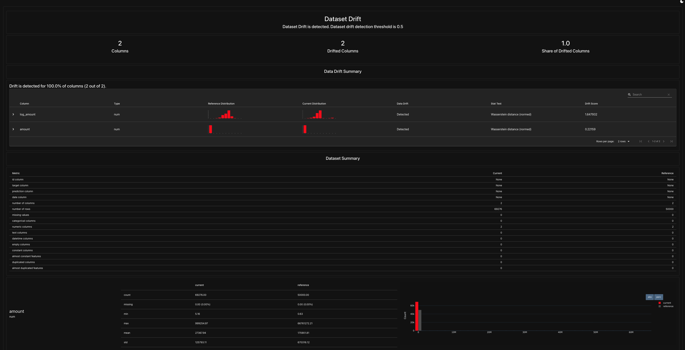
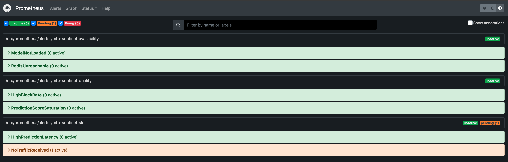

# Phase 5 — Production Monitoring Stack

> Prometheus tells us what's happening right now. Evidently tells us whether
> the data has shifted from training. They're orthogonal and complementary —
> a real fraud team needs both.

## Architecture

```
Locust ──────► FastAPI (uvicorn on host) ──────► /metrics
                       │                              │
                       ├─► Redis (feature store)      │
                       │                              │
                       └─► SQLite (prediction log)    │
                                                      ▼
                              Prometheus (Docker container, scrapes every 5s)
                                                      │
                                                      ▼
                              Grafana (Docker, dashboards)
                              + Prometheus /alerts (6 rules)
                                                      │
              Evidently (offline batch job) ◄─────────┘
              ├─ reference: training parquet sample
              └─ current: prediction log → HTML drift report
```

One command brings up the whole observability stack:

```bash
docker compose up -d
```

## Grafana dashboard

Seven panels showing the live service:

- Predictions per second by decision (APPROVE vs BLOCK)
- Prediction latency p50/p95/p99 with SLO threshold (100ms)
- Fraud probability distribution (histogram bucket rates)
- Block rate (last 5 min) — thresholded green/yellow/red
- Total predictions served (counter)
- Service health (model loaded, Redis reachable)
- Redis lookup latency p99


Sanity checks visible at a glance:
- **Block rate ≈ 5%** — matches the Locust traffic mix (90% clean PAYMENT, 5% clean CASH_OUT, 5% fraud TRANSFER)
- **p99 latency well under 100ms** even with shadow scoring on
- **Redis p99 ≈ 10-20ms** — Docker-on-macOS network overhead; would be sub-millisecond on Linux

## Evidently drift reports

Compares the live prediction log against a 50K-row sample of training data.
Uses Wasserstein distance (normed) by default, with a drift threshold of 0.5.

A 30-second Locust burst against the live service produces an interesting result:

| Feature | Reference mean | Current mean | Drift score | Detected? |
|---|---:|---:|---:|:---:|
| `log_amount` | 10.83 | 7.82 | **1.6479** | ✅ |
| `amount` (€) | 175,901 | 27,367 | **0.2216** | ✅ |



**100% of monitored features drifted** — and that's correct. Locust generates
synthetic uniform-random amounts (5 to 1M); real PaySim has a heavy right
tail (max €66M). The model's input distribution at inference is genuinely
different from training. Evidently caught it.

This is the kind of finding a real fraud team would investigate within hours:
either Locust is unrepresentative (true here), or genuine population drift is
happening and the model needs retraining.

**Design note:** the production prediction log deliberately stores only
`tx_type`, `tx_amount`, and `name_orig` — not the full feature vector. Real
fraud logs avoid PII retention. As a result Evidently can only compare on
features reconstructible from the logged columns. On a real deployment with
full feature logging or a separate feature store, all 23 features would
participate in drift detection.

## Prometheus alert rules

Six rules in three groups:

| Group | Rule | Expression | Threshold |
|---|---|---|---|
| `sentinel-slo` | `HighPredictionLatency` | p99 latency | > 100ms for 2m |
| `sentinel-slo` | `NoTrafficReceived` | total rate | == 0 for 5m |
| `sentinel-quality` | `HighBlockRate` | BLOCK / total | > 20% for 5m |
| `sentinel-quality` | `PredictionScoreSaturation` | proba > 0.99 share | > 50% for 5m |
| `sentinel-availability` | `ModelNotLoaded` | model_loaded gauge | == 0 for 1m |
| `sentinel-availability` | `RedisUnreachable` | redis_reachable gauge | == 0 for 1m |



In production these would route through Alertmanager to Slack and/or
PagerDuty. The portfolio version stops at the alert-rule level, which is
where most of the engineering work actually lives.

## Performance impact of monitoring

The `/metrics` endpoint adds negligible overhead — Prometheus client library
generates the text-format response in well under a millisecond. Verified
during Phase 3 load testing: throughput numbers were identical with and
without `/metrics` instrumentation.

## Artifacts

| Path | What |
|---|---|
| `docker-compose.yml` | Redis + Prometheus + Grafana, one command |
| `monitoring/prometheus/prometheus.yml` | Scrape config |
| `monitoring/prometheus/alerts.yml` | Six alert rules |
| `monitoring/grafana/provisioning/` | Datasource + dashboard auto-provisioning |
| `monitoring/grafana/dashboards/sentinel.json` | The dashboard, version controlled |
| `monitoring/evidently/generate_drift_report.py` | Drift report generator |
| `monitoring/evidently/reports/drift_latest.html` | Latest drift report |